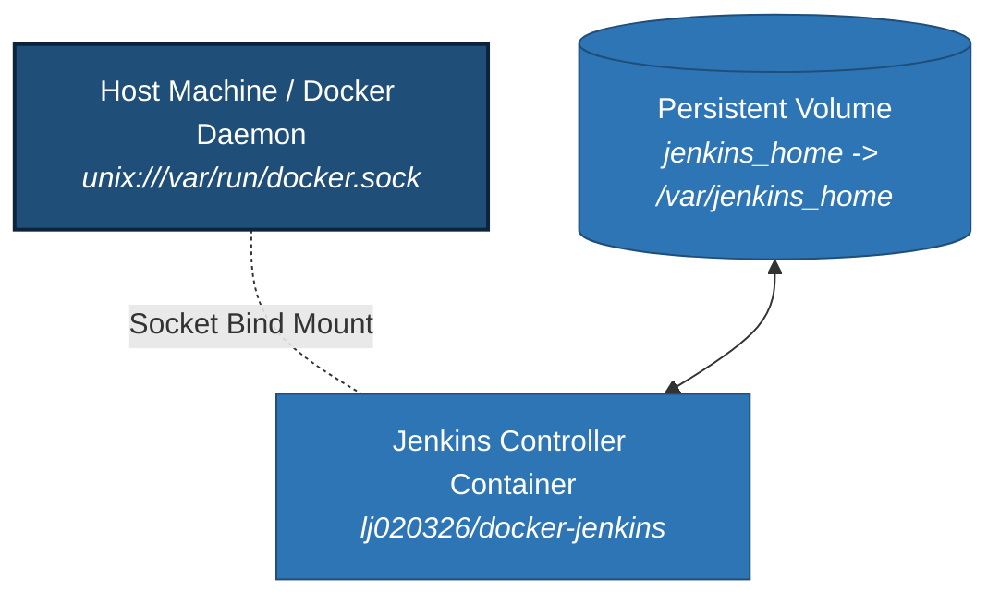

[](LICENSE.md)

# Jenkins Master Controller in Docker

An enterprise-grade, containerized Jenkins controller infrastructure engineered with built-in Docker engine integration, dynamic auto-credential expanding hooks, and configuration-as-code automation. Designed to serve as the core orchestrator for distributed pipeline execution, this image provides an out-of-the-box platform for managing build workloads, downstream worker agents, and enterprise integrations.

---

## 📑 Table of Contents
* [Overview & Architecture](#overview-architecture)
* [CI Status & Metrics](#ci-status-metrics)
* [Docker Sockets & Mounting Strategies](#-docker-sockets--mounting-strategies)
* [Deployment & Quickstart](#-deployment--quickstart)
* [Configuration & Entrypoint Control](#-configuration--entrypoint-control)
* [Testing](#testing)
* [Identity & Maintainer](#identity-maintainer)

---

## <a id="overview-architecture"></a>📐 Overview & Architecture

Running Jenkins in Docker provides rapid deployment and environment consistency while allowing full control over exposed web interfaces and build execution environments. This image builds upon the official Jenkins Long Term Support (LTS) foundation, installing Docker CE runtime utilities directly inside the container and adding the `jenkins` user to the `docker` group for seamless host daemon socket access.

There is an associated technical guide available for deeper context on architecture and configuration:
* [Quickstart CI with Jenkins and Docker-in-Docker](https://github.com/lj020326/pipeline-automation-lib/blob/main/docs/jenkins-docker-in-docker-agent.md)



It is highly recommended to create an explicit volume on the host machine to preserve build jobs, configuration, and state across container restarts and updates:
`-v jenkins_home:/var/jenkins_home`

---

## <a id="ci-status-metrics"></a>🛠️ CI Status & Metrics

[](https://hub.docker.com/repository/docker/lj020326/docker-jenkins)
[](https://github.com/lj020326/jenkins-docker/stargazers)
[](https://github.com/lj020326/jenkins-docker/actions/workflows/build-images.yml)
[](https://github.com/lj020326/jenkins-docker/issues)

---

## 🐳 Docker Sockets & Mounting Strategies

Running nested container builds can present complexities when operating within a containerized environment (for more details, see [Docker in Docker: The Good, the Bad, and the Fix](https://github.com/lj020326/pipeline-automation-lib/blob/main/docs/docker-in-docker-the-good-the-bad-and-the-fix.md)).

The recommended approach avoids running a secondary nested Docker daemon. Instead, the container's internal Docker CLI connects directly to the host system's Docker daemon by bind-mounting the host engine socket:

`-v /var/run/docker.sock:/var/run/docker.sock`

This ensures a single, high-performance Docker daemon powers both host and container build workflows safely. Additional architecture details can be found in [Docker Inside a Docker Container](https://github.com/lj020326/pipeline-automation-lib/blob/main/docs/docker-inside-a-docker-container.md).

---

## 🚀 Deployment & Quickstart

### Pull and Run from Docker Hub

```shell
docker run -d -p 8080:8080 -p 50000:50000 \
    --name jenkins-controller \
    -v jenkins_home:/var/jenkins_home \
    -v /var/run/docker.sock:/var/run/docker.sock \
    --restart unless-stopped \
    lj020326/docker-jenkins:latest
```

### Build and Run Locally

```shell
# Clone repository
git clone https://github.com/lj020326/jenkins-docker.git
cd jenkins-docker

# Build image
docker build -t docker-jenkins:local .

# Execute container
docker run -d -p 8080:8080 -p 50000:50000 \
    --name jenkins-controller \
    -v jenkins_home:/var/jenkins_home \
    -v /var/run/docker.sock:/var/run/docker.sock \
    --restart unless-stopped \
    docker-jenkins:local
```

---

## ⚙️ Configuration & Entrypoint Control

The image includes specialized entrypoint wrappers for automated secret expansion and dynamic credential injection from mounted files or Docker secrets:

* **Secret Expansion (`env_secrets_expand.sh`):** Scans environment variables prefixed with `dksec://` or `dkseckey://` to expand secret values directly from `/run/secrets/` into the workspace environment.
* **Auto-Credential Provisioning (`entrypoint.auto-credential.sh`):** Automatically generates and mounts Jenkins XML credential entries (SSH keys, username/password pairs, secret text tokens) dynamically at container launch.

---

## <a id="testing"></a>🧪 Testing

See the [TESTING.md](TESTING.md) for information on how to run the necessary tests.

---

## <a id="identity-maintainer"></a>🛡️ Identity & Maintainer

* **Maintainer:** Lee Johnson
* **Contact:** <ljohnson@dettonville.org>
* **LinkedIn:** https://www.linkedin.com/in/leejjohnson/
* **System Framework:** [Dettonville Cloud Infrastructure Services](https://dettonville.org)
