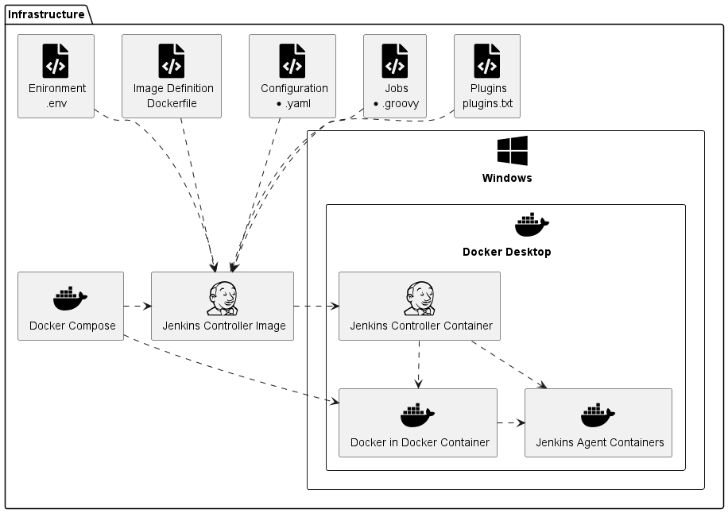
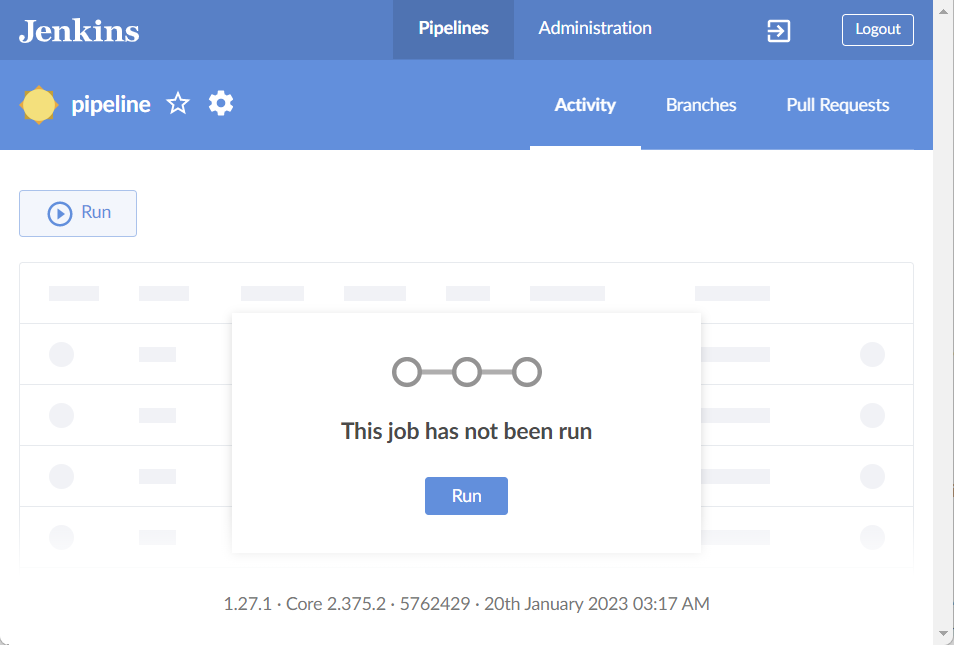
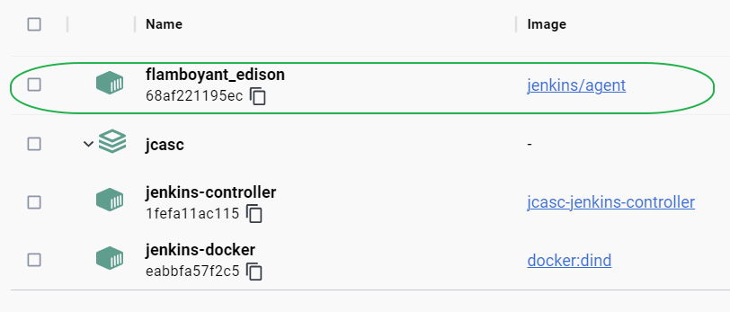
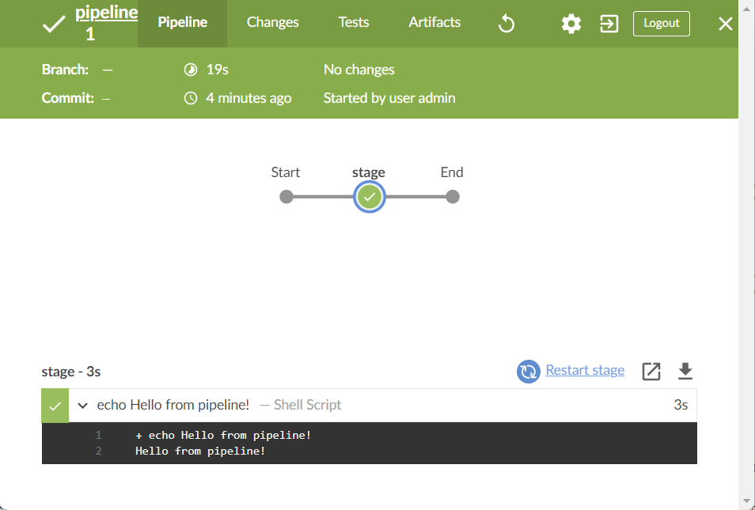

# Jenkins Configuration as Code (JCasC)

## Build your reproducable local Jenkins Instance

In most of my environments I reach in short time the requirement to have some kind of automation server. How cool would it be, to start this server as part of my local Virtual Development Server? And what if the result will be usable for a lot of other use cases too?

Here you see the architecture overview:



First I create a Dockerfile file for my Jenkins Controller Image:

Dockerfile
```Dockerfile
FROM jenkins/jenkins:lts-jdk17
ENV JAVA_OPTS -Djenkins.install.runSetupWizard=false
ENV CASC_JENKINS_CONFIG /var/jenkins_home/casc.yaml
COPY casc.yaml /var/jenkins_home/casc.yaml
COPY pipeline.groovy /var/jenkins_home/pipeline.groovy
COPY plugins.txt /usr/share/jenkins/ref/plugins.txt
RUN jenkins-plugin-cli -f /usr/share/jenkins/ref/plugins.txt
```

-   I base my Dockerfile on the latest official long time support Jenkins controller image for JDK 17.
    
-   Via Java Options I tell the controller not to run the setup wizard on startup.
    
-   Via an environment variable I tell the configuration-as-code plugin how the configuration file is named.
    
-   Then I copy this configuration file, a groovy file with job definitions and a file with the used plugins to the image.
    
-   When the container starts, the plugins will be installed.
    

In this referenced file I define the plugins, which I want to install:

plugins.txt
```
authorize-project:latest
blueocean:latest
configuration-as-code:latest
docker-plugin:latest
job-dsl:latest
locale:latest
matrix-auth:latest
```

The plugins depend on your configuration, at least you need the configuration-as-code and job-dsl plugins.

Then I use the Dockerfile in Docker Compose:

docker-compose.yaml
```yaml
version: '3.8' ## (1)
services:
  jenkins-controller: ## (2)
    ## (3)
    build: .
    container_name: jenkins-controller
    environment:
      - DOCKER_CERT_PATH=/certs/client
      - DOCKER_HOST=tcp://docker:2376
      - DOCKER_TLS_VERIFY=1
      ##  (4)
      - JENKINS_ADMIN_ID=${ENV_JENKINS_ADMIN_ID}
      ##  (5)
      - JENKINS_ADMIN_PASSWORD=${ENV_JENKINS_ADMIN_PASSWORD}
    networks:
      - jenkins
    ports:
      - "8080:8080"
      - "50000:50000"
    restart: unless-stopped
    volumes:
      - jenkins-data:/var/jenkins_home
      - jenkins-docker-certs:/certs/client:ro

  docker-dind: ## (6)
    command: --storage-driver=overlay2
    container_name: jenkins-docker
    environment:
      - DOCKER_TLS_CERTDIR=/certs
    image: docker:dind
    links:
      - "jenkins-controller:docker"
    networks:
      - jenkins
    ports:
      - "2376:2376"
    privileged: true
    restart: unless-stopped
    volumes:
      - jenkins-data:/var/jenkins_home
      - jenkins-docker-certs:/certs/client

networks:
  jenkins:
    name: jenkins

volumes:
  jenkins-data:
  jenkins-docker-certs:
```

**1** The most parameters in the file come from [Jenkins documentation](https://www.jenkins.io/doc/book/installing/docker/#on-windows). 
**2** I build the Jenkins Controller Service 
**3** from the Dockerfile, which is found in the current directory. 
**4** The administration user 
**5** and password comes in my case from a local .env file, which will normally not be checked in, as it contains sensitive information. For this blog it is checked in for completeness. 
**6** The Docker in Docker service is needed for ephemeral Docker Agent containers later and is loaded from an official Docker image.

Additional to the user and password I set my development server component to [a unique name](https://docs.docker.com/compose/reference/envvars/#compose_project_name) in the [.env](https://docs.docker.com/compose/environment-variables/#the-env-file) file.

.env
```shell
COMPOSE_PROJECT_NAME=jcasc
ENV_JENKINS_ADMIN_ID=admin
ENV_JENKINS_ADMIN_PASSWORD=admin
```

For the Jenkins Configuration as Code plugin I create following file:

casc.yaml
```yaml
jenkins:
  agentProtocols:
  - "JNLP4-connect"
  - "Ping"
  authorizationStrategy:
    globalMatrix: ## (1)
      permissions:
      - "USER:Overall/Administer:${JENKINS_ADMIN_ID}"
      - "GROUP:Overall/Read:authenticated"
  clouds:
  - docker: ## (2)
      containerCap: 5
      dockerApi:
        connectTimeout: 60
        dockerHost:
          uri: "tcp://host.docker.internal:2375"
        readTimeout: 60
      exposeDockerHost: true
      name: "docker"
      templates:
      - connector: "attach"
        dockerTemplateBase:
          cpuPeriod: 0
          cpuQuota: 0
          image: "jenkins/agent" ## (3)
        instanceCapStr: "10"
        labelString: "agent" ## (4)
        mode: EXCLUSIVE
        name: "Jenkins Agent"
        pullStrategy: PULL_ALWAYS
        pullTimeout: 300
        remoteFs: "/home/jenkins/agent"
  crumbIssuer:
    standard:
      excludeClientIPFromCrumb: false
  disableRememberMe: false
  labelAtoms:
  - name: "!!!DO_NOT_USE!!!"
  - name: "agent"
  - name: "docker_in_docker"
  - name: "master"
  labelString: "!!!DO_NOT_USE!!!"
  numExecutors: 0 ## (5)
  remotingSecurity:
    enabled: true
  securityRealm: ## (6)
    local:
      allowsSignup: false
      users:
        - id: ${JENKINS_ADMIN_ID}
          password: ${JENKINS_ADMIN_PASSWORD}
jobs: ## (7)
  - file: /var/jenkins_home/pipeline.groovy
security:
  queueItemAuthenticator:
    authenticators:
    - global:
        strategy: "triggeringUsersAuthorizationStrategy"
unclassified:
  locale:
    ignoreAcceptLanguage: true
    systemLocale: "en"
  location:
    url: "http://localhost:8080/"
```

**1** For the matrix authorization plugin I add global administration rights to the admin user and global read rights to all authenticated users. 
**2** I add a Docker cloud, which provides ephemeral containers 
**3** from the official Jenkins agent image every time a build requests an agent 
**4** with the label agent. 
**5** For implementing best practices the Jenkins controller has no Executors. 
**6** I add the admin user to the security realm. 
**7** Via a file I create all required jobs.

Luckily I do not have to know all the configuration beforehand. Instead, I:

-   start with a Dockerfile with -Djenkins.install.runSetupWizard=true
    
-   make all configuration by hand
    
-   Export the configuration via "Manage Jenkins → Configuration as Code → Download View Configuration"
    
-   add all required configuration to the casc.yaml file
    
-   test with -Djenkins.install.runSetupWizard=false
    

As last file I create:

pipeline.groovy:
```groovy
pipelineJob('pipeline') {
  definition {
    cps {
      script(
'''pipeline {
  agent {
    label 'agent'
  }
  stages {
    stage('stage') {
      steps {
        sh 'echo Hello from pipeline!\'
      }
    }
  }
}''')
      sandbox()
    }
  }
}
```

In my example I create a pipeline which do a simple "Hello".

Now I start my Jenkins environment via:

```shell
docker compose up --detach
```

My services from the docker-compose.yml now starts as containers from built respectively pulled container. On [http://localhost:8080](http://localhost:8080/) I can now open the configured Jenkins controller and enter the user and password from my .env file. I can check the complete configuration.

For testing, I can now build my created pipeline:



The build starts now an ephemeral Docker container:



In the output of the build you see now the simple "Hello":



You find all sources on [GitHub](https://github.com/lj020326/vds_jenkins_with_docker_desktop_jcasc).

That’s it!

## Reference

- https://www.amapac.io/blog/2023/vds_jenkins_with_docker_desktop_jcasc.html
- https://github.com/amapac-io/vds_jenkins_with_docker_desktop_jcasc
- 
